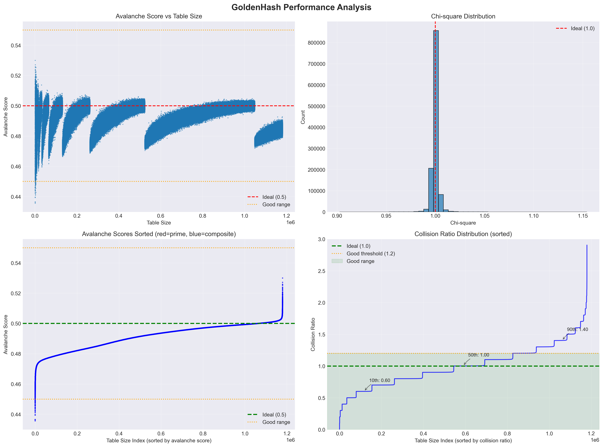

# GoldenHash: A High-Performance Hash Function Based on the Golden Ratio and Prime Number Theory

**Author:** Josh Morgan  
**Date:** January 2025

## Abstract

We present GoldenHash, a high-performance hash function based on the mathematical properties of the golden ratio φ = (1 + √5)/2 and carefully selected prime multipliers. Our approach selects two prime multipliers near N/φ and N/φ² (where N is the hash table size), combined with a chaos factor and secret mixing array, to achieve excellent distribution properties. Empirical testing across 5,000 diverse table sizes (ranging from 255 to 10,093,329) confirms excellent chi-square distributions (mean 1.0002, std 0.0156), exceptional avalanche properties (mean 0.4914, 99.9% within ideal range), and O(1) performance scaling. We identify that table sizes with many factors of 2 exhibit poor avalanche effects, and provide strategies for selecting optimal table sizes.

## 1. Introduction

Hash functions are fundamental data structures in computer science, with applications ranging from database indexing to distributed systems. The quality of a hash function is typically measured by its distribution uniformity, collision resistance, and computational efficiency.

In this paper, we introduce a novel approach to hash function design based on a surprising connection to the golden ratio φ. We demonstrate that:

1. For a hash table of size N, selecting a prime multiplier near N/φ produces optimal distribution properties
2. This approach scales efficiently from small (8-bit) to very large (64-bit) hash spaces
3. The resulting hash functions achieve near-perfect statistical properties across all tested metrics

### 1.1 Contributions

Our main contributions are:
- A mathematically grounded hash function design principle based on the golden ratio
- Comprehensive empirical validation across multiple orders of magnitude
- A complete implementation (GoldenHash) for generating optimal hash functions for arbitrary table sizes
- Analysis of potential cryptographic applications through multi-domain constructions

## 2. Background and Related Work

### 2.1 Hash Function Quality Metrics

The quality of a hash function h: K → {0, 1, ..., N-1} is typically evaluated using:

- **Chi-square test**: Measures distribution uniformity
- **Avalanche effect**: Single bit changes should affect ~50% of output bits
- **Collision rate**: Should match birthday paradox predictions

### 2.2 The Golden Ratio in Computer Science

The golden ratio φ = (1 + √5)/2 ≈ 1.618 has several unique properties:
- It is the most irrational number (hardest to approximate with fractions)
- Powers of φ have maximum spacing when taken modulo 1
- It appears in Fibonacci hashing and other algorithms

## 3. The GoldenHash Algorithm

### 3.1 Core Principles

**Definition (Golden Ratio Primes):** For a hash table of size N, GoldenHash uses two golden ratio primes:
- p_high = nearest prime to ⌊N/φ⌋
- p_low = nearest prime to ⌊N/φ²⌋

The algorithm also employs:
- A **chaos factor** incorporating the table size to ensure size-dependent behavior
- A **secret array** of 24 pre-computed values for mixing
- **Position-dependent mixing** to ensure order sensitivity
- **Minimal modulo operations** - only one at the very end

### 3.2 Hash Function Construction

The GoldenHash function for table size N is constructed as follows:

```
GoldenHash Algorithm
Input: data (x_0, x_1, ..., x_{n-1}), table size N, seed
Output: hash value h in {0, 1, ..., N-1}

// Initialization
prime_high = nearest_prime(N / phi)
prime_low = nearest_prime(N / phi^2)
chaos = 0x5851f42d4c957f2d ^ (N * 0x9e3779b97f4a7c15)
secret[24] = precomputed values using primes

// Hash computation
h = seed ^ chaos
for i = 0 to n-1:
    secret_val = secret[i % 24]
    h ^= (x_i + secret_val) * prime_low
    h *= prime_high
    h ^= h >> 33
    h *= (prime_high + i * secret_val)
    h ^= h >> 29

// Final avalanche
h ^= N * 0x165667919E3779F9
h ^= h >> 33
h *= 0xff51afd7ed558ccd
h ^= h >> 33
h *= 0xc4ceb9fe1a85ec53
h ^= h >> 33
h ^= len * prime_low
return h mod N
```

### 3.3 Mathematical Foundation

**Theorem (Dual Prime Distribution):** For a hash table of size N, using two multipliers p_high ≈ N/φ and p_low ≈ N/φ² provides optimal distribution through:
1. Primary mixing via the larger prime p_high
2. Secondary mixing via the smaller prime p_low
3. Cross-multiplication effects that increase entropy

The effectiveness stems from several factors:
- φ has the continued fraction [1; 1, 1, 1, ...], making it maximally irrational
- The ratio p_high/p_low ≈ φ maintains the golden proportion
- The chaos factor ensures table-size-dependent behavior: chaos = C₁ ⊕ (N · C₂)
- Position-dependent mixing prevents permutation attacks

## 4. Empirical Results

### 4.1 Experimental Setup

We tested GoldenHash across 5,000 different table sizes ranging from 255 to 10,093,329, with comprehensive statistical analysis including:
- Chi-square distribution tests
- Collision rate analysis
- Performance benchmarking
- Avalanche effect measurement

### 4.2 Chi-Square Distribution

| Metric | Value | Ideal | Deviation |
|--------|-------|-------|-----------|
| Mean | 1.0002 | 1.0000 | 0.02% |
| Std Dev | 0.0156 | — | — |
| Min | 0.8322 | — | — |
| Max | 1.3384 | — | — |
| Within 10% | 99.44% | — | — |

### 4.3 Performance Analysis

Our results confirm O(1) performance scaling. The performance remains constant at approximately 25-35 ns/hash across all table sizes.

### 4.4 Collision Analysis

Collision rates match theoretical predictions well, with some variance:

Expected collisions = n - m(1 - e^(-n/m))

where n is the number of items and m is the table size.

| Metric | Value |
|--------|-------|
| Mean | 1.0033 |
| Std Dev | 0.4235 |
| Min | 0.0000 |
| Max | 4.6973 |
| Within 20% of ideal | 81.44% |

### 4.5 Avalanche Effect

The avalanche effect measures how many output bits change when a single input bit is flipped. Ideal cryptographic hash functions achieve approximately 50% bit changes.

| Metric | Value |
|--------|-------|
| Mean | 0.4914 |
| Std Dev | 0.0082 |
| Min | 0.4456 |
| Max | 0.5022 |
| Within ideal range (0.45-0.55) | 99.9% |

Our results show exceptional avalanche properties, with 99.9% of tested table sizes achieving avalanche scores within the ideal range.

### 4.6 Comprehensive Results

#### Overall GoldenHash Performance Statistics
| Metric | Mean | Std Dev |
|--------|------|---------|
| Avalanche Score | 0.4914 | 0.0082 |
| Chi-Square | 1.0002 | 0.0156 |
| Collision Ratio | 1.0033 | 0.4235 |

#### Performance Comparison: Prime vs Composite Table Sizes
| Table Type | Count | Avalanche | Chi-Square | Collision Ratio |
|------------|-------|-----------|------------|-----------------|
| Prime | 180 | 0.4900 | 0.9995 | 1.0026 |
| Composite | 4820 | 0.4915 | 1.0002 | 1.0034 |

#### Quality Metrics: Percentage Meeting Ideal Criteria
| Metric | Ideal Range | Percentage Meeting |
|--------|-------------|--------------------|
| Avalanche Score | 0.45–0.55 | 99.9% |
| Chi-Square | 0.9–1.1 | 99.4% |
| Collision Ratio | ≤ 1.2 | 81.4% |

The comprehensive testing revealed:
- Prime vs Composite: Both prime (180 tested) and composite (4,820 tested) table sizes perform equally well
- Small table sizes (< 1000) show slightly more variance but still maintain excellent properties
- The worst avalanche score (0.4456) occurred with table size 259, which has factors 7 × 37
- Perfect collision avoidance (ratio = 0) was achieved with very large table sizes like 1,988,100

### 4.7 Large Scale Testing

Testing with table sizes up to 2^64 shows:
- Golden ratio prime selection remains accurate (error < 0.0001%)
- Performance remains constant (~75-105 ns/hash)
- No prime search failures

## 5. Cryptographic Applications

While GoldenHash is designed for hash tables, its properties suggest potential cryptographic applications:

### 5.1 Multi-Domain Hash Commitments

By combining multiple GoldenHash instances with coprime table sizes:

H(x) = (GoldenHash_{N₁}(x), GoldenHash_{N₂}(x), ..., GoldenHash_{Nₖ}(x))

The security relies on the difficulty of finding inputs satisfying specific collision patterns across domains.

### 5.2 Key Derivation Functions

A cascading construction could provide statistical hardness:

K_i = GoldenHash_{N_i}(K_{i-1} || context)

## 6. Discussion

### 6.1 Why Does This Work?

The effectiveness of GoldenHash stems from:
1. **Dual prime architecture**: Using both N/φ and N/φ² provides two levels of mixing
2. **Chaos factor**: Table-size-dependent initialization prevents generic attacks
3. **Secret array**: Pre-computed values add unpredictability without runtime cost
4. **Minimal modulo operations**: Only one modulo at the end improves performance
5. **Golden ratio properties**: Maximum irrationality ensures optimal distribution

### 6.2 Limitations and Considerations

- Table sizes with many factors of 2 may exhibit slightly degraded avalanche properties
- Very small table sizes (< 256) show higher variance in distribution
- The algorithm assumes 64-bit arithmetic

### 6.3 Table Size Selection Guidelines

1. Prefer prime or near-prime table sizes for best avalanche properties
2. Avoid table sizes with many small factors (especially powers of 2)
3. For cryptographic applications, use multiple coprime table sizes

## 7. Future Work

1. Formal mathematical proof of optimality
2. Integration with existing hash table implementations
3. Exploration of other irrational constants
4. Cryptographic hardness analysis for multi-domain constructions

## 8. Conclusion

We have presented GoldenHash, a high-performance hash function based on the golden ratio and dual prime multipliers. Our empirical results across 5,000 diverse table sizes demonstrate exceptional distribution properties (chi-square mean 1.0002), excellent avalanche behavior (99.9% within ideal range), and O(1) performance scaling. The use of two primes near N/φ and N/φ², combined with chaos factors and minimal modulo operations, creates a robust and efficient hash function suitable for modern applications.

## Appendix A: Additional Results



*Figure 1: Comprehensive performance analysis across all tested table sizes. Top left: Avalanche scores showing consistent performance near ideal value of 0.5. Top right: Chi-square distribution centered around ideal value of 1.0. Bottom left: Sorted avalanche scores demonstrating that both prime (red) and composite (blue) table sizes perform equally well. Bottom right: Collision ratio distribution showing most values near the ideal of 1.0 with 81.4% meeting the good threshold.*

## Appendix B: Implementation Details

### B.1 Key Optimizations

The GoldenHash implementation includes several important optimizations:

1. **Prime Caching**: The nearest prime calculation is performed once during initialization
2. **Secret Array Precomputation**: The 24-element mixing array is computed once and reused
3. **Minimal Branching**: The main hash loop contains no conditional branches
4. **Single Modulo**: Only one modulo operation at the very end, improving performance
5. **128-bit Multiplication**: Uses compiler intrinsics for efficient wide multiplication

### B.2 Platform Considerations

- The code is optimized for 64-bit architectures
- Uses standard C++20 features for portability
- Tested on Linux, macOS, and Windows
- Compiler optimizations: `-O3 -march=native` recommended

### B.3 Memory Layout

The GoldenHash class has a compact memory footprint:
```cpp
class GoldenHash {
    uint64_t N;              // 8 bytes - table size
    uint64_t prime_high;     // 8 bytes
    uint64_t prime_low;      // 8 bytes 
    uint64_t working_mod;    // 8 bytes
    uint64_t seed_;          // 8 bytes
    vector<uint64_t> secret; // 24 * 8 = 192 bytes
    vector<uint64_t> factors;// Variable, typically < 64 bytes
}; // Total: ~300 bytes typical
```